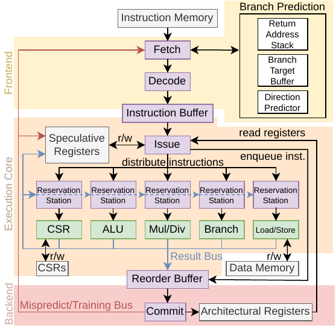

Speculative Configurable Out-of-Order Teaching-Enhanced RISC-V (SCOoOTER) is a processor creation framework aimed at educational usage.
SCOoOTER is built with clean, easy-to-understand interfaces such that students can start extending or exchanging parts easily.
SCOoOTER has various configuration options, simulation, and implementation targets to facilitate exploration of different design choices.

## Block Diagram

## Documentation
The documentation can be found in the `docs` directory. The documentation can be built using Sphinx and RTT.
With all prerequisites installed, run `make html` to build the documentation.

## WIP

Most components have already been published. Our fork of Embench-IoT is in the process of being published.
Until then, all features except Embench benchmark execution are functional.
