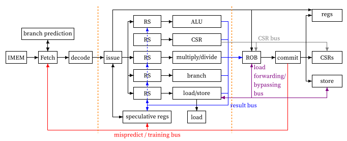

Speculative Configurable Out-of-Order Teaching_Enabled RISC-V (SCOoOTER) is a processor creation framework aimed at educational usage.
SCOoOTER is built with clean easy to understand interfaces such that students can start extending or exchanging parts easily.
SCOoOTER has various configuration options, simulation and implementation targets to facilitate exploration of different design choices.

## Block Diagram



## Documentation
The documentation can be found [here](https://gitlab.esa.informatik.tu-darmstadt.de/Documents/ThesisProjects/MA_DA/2022-scheck-markus).

## Building

You may build SCOoOTER as an IP core. SCOoOTER uses BSVTools.

To create an IP core, run
```
make SIM_TYPE=VERILOG ip
```

SCOoOTER additionally supports OpenLane for synthesis.
To add SCOoOTER to OpenLane, run
```
make SIM_TYPE=VERILOG openlane
```

## Simulating

SCOoOTER may be simulated using BlueSim.
Refer to .gitlab-ci.yml for parameters necessary to execute our provided testbenches.

To execute a custom program binary, set the path to your binary in Testbench.bsv and run
```
make TB=CUSTOM_TB
```


## Contributors
This processor is implemented by Markus Scheck as a master's thesis. The thesis is supervised by Yannick Lavan.

