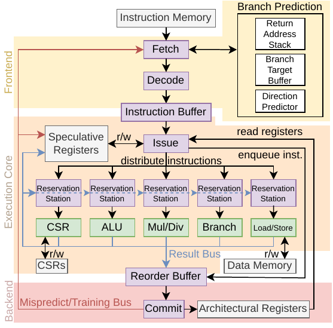
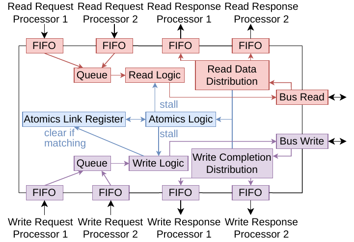

# Architecture overview

SCOoOTER is a superscalar, speculative out-of-order processor. Additionally, SCOoOTER supports multicore and multithread systems. We introduce the overall architecture from the bottom up. First, the processor core, then the memory arbitration and lastly the uncore bus system are explained. The processor core itself is described in a top-down manner: We introduce larger units and delve into the implementation details as necessary.

## Processor core

First, lets start with the processor core itself. SCOoOTER follows `Computer Architecture - A quantitative approach` by Hennessy and Patterson. Consequently, the textbook is a good introduction for understanding SCOoOTER.
Before working with SCoOTER, students should gain an overview of Tomasulo's algorithm from said textbook.

SCOoOTER is separated into three large components:

### Frontend

Deals with the fetching and decoding of instructions. Additionally provides the branch prediction. Decoded instructions are placed in the `instruction window`, a FIFO buffer between the frontend and execution core.

### Execution core

Deals with the execution of instructions. The issue stage dequeues instructions from the instruction window, places them in the reorder buffer and distributes them to the reservation stations. Each reservation station passes ready instructions to the functional unit tasked with execution. An instruction is ready once all operands are available. The functional unit announces the result on the result bus, from where the reservation stations and the reorder buffer may latch the result. The reorder buffer provides instructions to the backend whenever they are ready. Two functional units are connected to the reorder buffer through a handshake interface since they must know whether an instruction is mispredicted or correct-path as they alter some state: the CSR unit and the Load/Store unit.

### Backend

The backend evaluates whether an instruction has been mispredicted, redirects the frontend if necessary and updates the architectural state. The register file is part of the backend. CSRs and the data memory / periphery interface are part of the responsible units and hence not located in the backend.

For more information on the implementation details, refer to the developer guide.

## Memory arbitration

If multiple cores are used, main memory access must be arbitrated. In future versions, a caching system should deal with arbitration. In the meantime, the __Data Arbitration and atomic ordering Verification Engine (DAVE)__ arbitrates access. The DAVE consists of two arbitrators - one for data memory and one for instruction memory. Requests from the cores are held in a queue. Whenever the bus is free, a request gets dequeued and handled. Atomic ordering of AMO instructions is also handled here. Additionally, the link register needed for lr/sc-Instructions is implemented here (refer to the RISC-V spec for more information).

## Uncore bus system

Apart from the core, an SoC is composed of periphery components. SCOoOTER uses a custom memory bus for integrated periphery and provides adapters to AXI4 and AXI4 Lite. Provided periphery components are memories (IMEM and DMEM), interrupt infrastructure (PLIC and CLINT) and the mentioned adapters. Memory decoders are used to route requests towards the correct component.