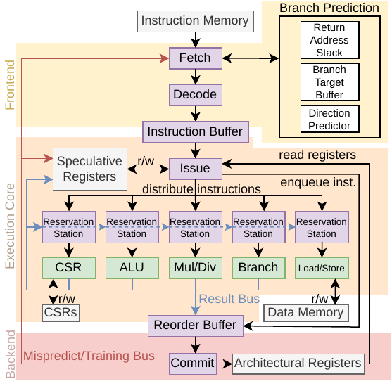
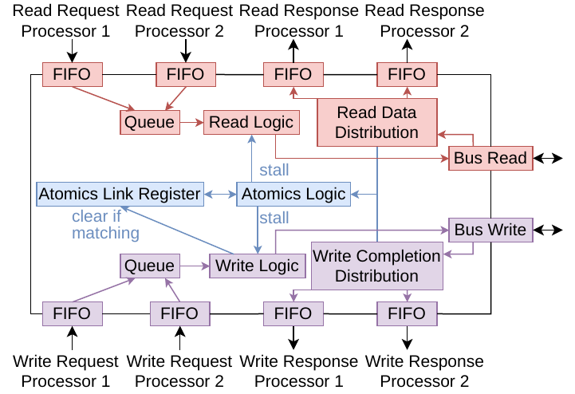

# Code overview and Architectural details

This file introduces the code structure of SCOoOTER. It is organized similarly to the source files of the repository. Implementation details and overall concepts are discussed here.

## Overall concepts

This section introduces important terms.

- Epoch: Since SCOoOTER may speculate, we must be able to detect wrong-path instructions. Each instruction is tagged with an Epoch value and every unit which may be affected by flushes has an epoch register. When a flush is notified to a unit, it increments its epoch register. Hence all instructions on the redirected path will have a different epoch value. This architecture allows us to asynchronously notify units of flushes and still maintain correct execution.

- Tag: To keep track of an instruction during execution, a tag is attached to it. The tag is derived from the occupied memory cell in the reorder buffer. The tag marks which result is meant for which rob entry.

## Architecture

SCOoOTER is a speculative, superscalar, multithreaded processor using a dynamic pipeline architecture. The frontend fetches instructions and elapses the branch prediction. The execution core executes instructions. The backend updates the processor state.

The result bus announces instruction results. The mispredict/training bus is used by the backend to notify the frontend of mispredictions and training information for the predictor.

We introduce the units by explaining the source code tree. Some complex units are shown with architectural figures. In those, PFIFO and BFIFO refer to BSV Pipeline and Bypass FIFOs.

For a deeper understanding of the employed concepts, please refer to the recommended literature in the introduction of this documentation.

## core

This folder contains the RTL code.

### libraries

Libraries used in the project. For `BlueAXI`, `BlueLib` and `BlueSRAM` refer to the project's documentation.

### src

- `Config.bsv` is the configuration file for the core.

- `Debug.bsv` is the debug library of SCOoOTER. Debug statements are always tagged in the RTL core. The available tags as well as which tags are currently printed can be selected in this file.

#### src_bus

Contains periphery components. `IDMemAdapter.bsv` instantiates the core and implements address decoding to forward requests and responses to the correct periphery components. Since responses from the periphery may arrive in any order, EHRs are used to establish a priority of result propagation.

`BRamDmem.bsv` and `BRamImem.bsv` implement block memories for FPGA use as IMEM and DMEM. `MemoryDecoder` implements helper functions for memory address decoding.

The `Periphery` folder contains periphery components. AXI adapters are self-explanatory. `CLINT` and `PLIC` implement the RISC-V interrupt infrastructure. `RVController` emulates the RVController from TaPaSCo-RISC-V.

#### src_core

RTL code for the processor core.

- `Types.bsv` defines numeric types.

- `Inst_Types.bsv` defines structs and enums used in the core. Especially, different used instruction formats are defined here.

- `Interfaces.bsv` defines interfaces for all main units.

- `RVFITracer.bsv` is used to trace instruction execution for `Core-V-Verif`

- `SCOOOTER_riscv.bsv` is the top-level module for a single processor. The module connects the frontend, execution core and backend. 

- `InstructionArbiter.bsv`, `Dave.bsv` and `MemoryArbiter.bsv` implement the arbitration of memory access between multiple cores. Dave instantiates the two arbiters. The instruction arbiter only supports read requests while the memory arbiter supports reads, writes and atomics.

- The `Primitives` folder contains generic modules, functions and reimplementations of StdLib components:

    - `TestFunctions.bsv` contains helper functions used in multiple places. 

    - `BuildList.bsv` implements similar functionality for lists as BuildVector does for vectors.

    - `GetPutCustom.bsv` defines custom GetPut interfaces.

    - `CWire.bsv` contains a CReg implementation, that does not preserve data between clock cycles.

    - `ShiftBuffer.bsv` contains modules to delay data for a fixed number of cycles.

    - `ESAMIMO.bsv` contains a BSV MIMO inplementation more suited towards our use-case.

    - `Ehr.bsv` contains an alternative CReg implementation.

    - `ArianeEhr.bsv` contains latch-based EHRs/CRegs based on the regfile of the Ariane processor.

The memory arbitration logic enables connecting multiple processors to the same
memory. In a multiprocessor system, the processors may share access to the
main memory. In a symmetric multiprocessor, any
processor may equally access any region of memory.
Another requirement necessitating arbitration is the execution of atomics. Since those accesses shall be atomic, parallel execution of further memory operations must be inhibited, even if they are originating from different processors. We 
implement those constraints in a module called Device Arbitration and atomic ordering Validation Engine (DAVE). The DAVE accepts read and write requests from
any processor in the system and organizes those requests in a queue. Memory
requests are executed from said queue via a custom memory bus. Whenever an operation
is marked as atomic, all further operations are stalled until the said atomic operation is complete. The DAVE also provides the monitoring required for LR/SC
instructions by providing the reservation register.
DAVE is composed of two sub-modules. One submodule arbitrates the data
memory while the other one arbitrates the instruction memory. The figure shows the data memory arbitration. Write requests originating
from the store buffers of the processors are enqueued into a MIMO structure. The
enqueue logic generates a vector of all incoming requests in the current cycle for
simultaneous enqueuing. Read and atomics requests originating directly from the
load/store units are enqueued into a separate queue. The completion logic then
dequeues operations sequentially from those queues. If an atomic operation is
detected, other writes and reads will be stalled until completion. We use the AXI
ID field to differentiate between multiple in-flight operations. The AXI ID consists
of the processor hardware thread ID and an additional bit to encode whether the
access is part of an atomic operation. We use the AXI ID to distribute replies to
the correct processor or the atomics logic. The instruction memory is arbitrated
similarly but writing and atomics handling is omitted as the instruction memory
is read-only.

##### frontend

The Frontend fetches and decodes instructions. 
The fetch stage gathers instructions and holds the program counter. It additionally interfaces with the branch prediction logic. The decode stage expands instructions.

###### fetch

Instructions are requested from the instruction memory (1). The instructions are read as a fetch width · 32 bit word and tagged with the current epoch (2). The instructions are predecoded to identify control flow instructions as an input to the branch prediction logic (3). The buffer collapse logic removes leading instructions (since a read from instruction memory must be aligned) and tags each instruction with the corresponding
program counter (4). The instructions are provided for the next stage. The count logic
identifies how many valid instructions were gathered. The next-PC logic (5) advances
the program counter based on branch prediction and redirect information as well as
the previous PC.

###### decode

The decode stage expands the fetched instructions into larger structures that separate the data fields of the instruction formats. For example, the opcode is evaluated, the instruction is tagged with the associated FU. BSV functions are used to check the instruction type and assemble the correct information. The final instruction
contains:

- FU type
- PC
- opcode
- function field (to distinguish between operations with the same Opcode)
- acquire and release flags (for atomics ordering, see [37])
- register addresses (for two operands and one destination)
- exception BSV Maybe (if a decode exception occurred)
- (precursor to) immediate value
- epoch
- predicted next PC
- history state (to restore predictors on mispredictions)

After the expansion logic, a MIMO buffer of configurable size
representing the instruction window is filled with said instructions. The buffer
must be at least the size of the fetch width. The decode stage processes up to as
many instructions per cycle as the fetch width.

###### Predictors

`Smiths`, `Gshare` and `Gskewed` are different algorithms to predict the direction of a branch. `AlwaysUntaken` is a dummy module to allow for disabling the predictors.

The branch direction predictors share a common interface allowing for simple
replacement. In gshare and
gskewed, all prediction ports must communicate their outcome to the next port
such that the Branch History Register (BHR) is correct if multiple branching instructions occur in a single clock cycle. 
The BHR holds the last n branch outcomes and is used for correlated prediction.
The prediction ports are implemented
with EHRs which pass on the prediction information. If a branch is predicted
as taken, all later branches in the same cycle are discarded as they belong to the
wrong path. The canonicalization logic updates the BHR for the next clock cycle.
If a misprediction occurs, the BHR is restored to the state of the mispredicted instruction and the storage is updated. The ports are implemented as BSV Server
interfaces and are only enabled if the associated instruction is a branch as determined during predecoding in the fetch stage. To achieve consistency of the
BHR, the direction prediction must be informed whether a target prediction has
been found for any branch. If no target is available, the prediction falls back to
predict the branch as untaken. The direction prediction is only used for conditional branch instructions (for the RISC-V ISA, those have the BRANCH opcode).
All input and output ports are unbuffered as we require the prediction result in
the same cycle as the prediction invocation. The predictor must provide an equal
port number as the fetch width, such that any fetched instruction may be predicted.

`RAS` and `BTB` implement the target predictors. Both are quite simple modules and are documented in-code.

##### exec_core (ExecCore.bsv)

The execution core executes instructions and provides their results. Additionally,
instruction reordering happens here. The execution core consists of multiple
units. The issue stage distributes instructions to the Reservation Stations (RSs) required by Tomasulo’s algorithm. Each RS is associated with one FU for result
calculation. Some FUs require further signaling, e.g. the memory and CSR units.
The Reorder Buffer (ROB) brings all instructions back into program order to enable
speculation. We first introduce the speculative register file as a means to store results during speculation. Then the issue stage, RSs and FUs are introduced.

###### speculative register file (RegFileEvo.bsv)

The speculative register file is part of the execution core and tracks results and
instruction tags. The instruction tags are derived from the ROB. If a misprediction occurs, all conents of said register file are flushed. The internal state consists
of EHRs that contain a tagged union which can either be tagged as empty, as an
instruction tag or as a value. Initially, the entire register file is tagged as empty. If
an instruction is issued, the destination register is tagged with the instruction tag
and the tag is replaced with the value from the result bus as soon as it is produced.
Reading the registers is implemented as a BSV Server interface. Holding the speculative results is
necessary since we cannot speculatively overwrite data in the architectural registers as the data must be restored upon misprediction. Tagging of registers is
required such that the issue stage may keep track of which registers have a pending write and correctly provide operands to later instructions.

###### issue stage (Issue.bsv)

The issue stage distributes instructions to the correct RS and the ROB. It additionally has to check that those can accept the issued instructions. While providing instructions to the RSs, the issue stage reads the speculative register file (1) and retrieves any results and instruction tags required
for the currently issued bundle of instructions. We refer to the size of the said bundle as the issue width. The speculative destination registers are tagged by the
issue stage with the now-issued instructions. The tag identifying an instruction is
derived from its position in the ROB storage. The different blocks of the issue stage
are separate BSV rules which are connected by wires. The dispatch amount logic (2)
calculates, based on free ROB slots, ready RSs and provided instructions from
the decode stage, how many instructions will be issued. Register tags are calculated based on the ROB head pointer and the issued number of instructions and
are written to the speculative register file. ROB entries are derived from the instructions and placed in the ROB (3). The dependency resolution logic resolves register
dependencies in a bundle of instructions that are issued simultaneously (4). If a register is written by an earlier instruction in the bundle and read by a later one, said
logic sets the tag of the earlier instruction as the operand for the later one. The
register reading logic reads data and tags from the register files. If the speculative register file does not contain any information, the issue stage must fall back to
the architectural registers. The reconstruction logic (5) combines all gathered information into instructions that are ready to issue. In essence, register numbers are
replaced by data or tags here. The instructions are then distributed to the correct RS.

###### reservation station (ReservationStation.bsv)

Instructions are provided by the issue stage and stored in the internal buffer. The RS monitors the result bus and
updates the stored instructions if any operand is tagged similarly to a currently
broadcast result. If an instruction in the buffer is ready, i.e. has all required
operands, it is dequeued and provided to the connected FU. Enqueue and dequeue operations are provided as blocking BSV methods. The result bus is a BSV
method that will never block as produced results are only valid during the cycle in which they are broadcast. Two RS implementations are provided. The BSV
module mkReservationStation allows for full reordering while mkLinearReservationStation keeps instructions in order as is necessary for the load/
store and CSR units. We provide options for the configuration of the RS depth per
FU type. The depth refers to the number of slots and hence the number of instructions that fit into an RS.

###### Store Buffer (StoreBuffer.bsv)

The store buffer receives
write requests from the load/store unit and contains them in a FIFO-like manner
until the memory arbitration logic dequeues them. It additionally provides a forwarding interface to the load/store unit. Internally, the store buffer is organized
as FIFO. If a write request is accepted by the arbitration logic, it is additionally held in an in-flight buffer, such that the value may
still be forwarded during write execution. The store buffer is informed of successful writes such that it may clear the in-flight buffer. The store buffer allows
for enqueueing and dequeuing of a single request per cycle.

###### functional units (unit folder)

FUs provide the result calculation of instructions.
An FU accepts incoming instructions with a blocking BSV method and provides a
result wrapped in a BSV Maybe type with a non-blocking output method (i.e. the Maybe is invalid when no result is available, and valid with the result value if there is one). Consequently, the result bus, a bus containing all results produced in the current clock
cycle, can always be assembled. The ALU and branch units follow the presented
simple design and hence provide a latency of one cycle. The ALU unit calculates
integer instructions (except multiply and divide). The branch unit calculates the
condition and target of control flow instructions.

The MulDiv consists of three sub-units for integer multiplication and signed or unsigned integer division. The user can configure whether those sub-units are single-cycle, multi-cycle or pipelined. The latency of the multi-cycle implementations is 35 cycles for divisions according to the BSV standard library source code and up to 32 cycles for a multiplication.
The multiplication is implemented by shifting the first operand to the left and the
second operand to the right by one space iteratively. If the second operand has
an LSB of 1, we add the first operand to the result. The calculation is complete if
either one of the operands becomes zero. The pipelined division also requires 35
cycles while the multiplication is reduced to six cycles as we produce all partial
sums in the first cycle and gradually add them in an addition tree structure. Arbitration in the form of a static order determines which result will be broadcast
first if multiple operations finish simultaneously.

The CSR unit has a similar organization to the simple FUs but adds an additional non-blocking
input method to stall its execution since we do not want to replicate the CSR register file as we did with the architectural register file to store speculative results. Hence, the CSR unit is provided with the ROB tail pointer to check whether an instruction is guaranteed to execute.
We decided against multiple CSR files as the CSRs control many system functions
that we do not want to change speculatively, CSR instructions are relatively infrequent, and the CSR file can grow large depending on the supported features.
Consequently. Additionally, the CSR unit adds a client interface to request CSR register reads. The
CSR unit requires instructions to stay in order such that the write in the ROB is
guaranteed to be cleared and no deadlock is possible. Consequently, the CSR unit
uses a linear RS.

The load/store unit implements memory
reordering constraints and hence requires a linear RS. It is separated into a store
pipeline, which creates write requests that will be stored in the ROB and evaluated
in the commit stage, and a load/atomics pipeline. The later pipeline first checks
that no pending writes are in the ROB and calculates the address. The next stage
evaluates the store buffer to forward the requested value if possible. For atomics,
no forwarding is allowed and the pipeline is stalled in case of a pending write
to the same address. The next stage requests a read or atomic operation from
the data memory arbitration logic if necessary and the last stage collects the result. The data memory arbitration logic, part of the overall system, accepts load/atomics requests and arbitrates between them.

##### backend (Backend.bsv)

The backend evaluates, whether instructions are on the correct path and updates
the architectural state accordingly. It consists of the commit stage as well as the
architectural state. The architectural state is composed of the registers, the CSRs,
and the memory. To keep up with the execution core, the backend must evaluate
an instruction amount equal to the issue width per cycle.

###### Regfile (RegFileArch.bsv)

The architectural register file stores the architectural registers. Since RISC-V hard-wires the first register to zero, our implementation only
includes 31 registers that store 32-bit words each. Ordering between writes in a
single cycle is provided by EHRs. The register file accepts an equal amount of
writes as the issue width. Twice as many read ports are necessary to provide all
issued instructions with their operands. If latch-based implementation is requested, the module imports `ArianeRegFile.bsv` based on the Ariane RISC-V core.

###### CSR file (CSRFile.bsv)

The CSR file is organized similarly to the register file. In addition to storing the
CSRs, the CSR file also provides interfaces to control portions of the processor.
The CSR file provides the following information to the commit stage:

- current trap vector (i.e. the exception handler address)
- current exception return vector
- currently enabled interrupts

The CSR file allows the commit stage to set the following information in case of
an exception:

- exception cause
- exception instruction address (where applicable)

The CSR file also provides a hardware thread ID such that programs can distinguish between different processors in a multiprocessor system. The IDs are numbered consecutively starting at zero. The currently implemented CSRs are:

- mcause - the exception cause register
- mie - the interrupt enable register
- misa- the machine ISA register
- mtvec - the trap vector register
- mepc - the exception PC register
- mstatus - the machine status register (needed for global interrupt enable)
- mscratch - scratch register for exception handlers
- mhartid - hardware thread ID register

###### reorder buffer (ReorderBuffer.bsv)

The ROB is needed to provide
precise rollback in case of a misprediction or exception. It serializes changes to
the architectural state which occur out of order in the dynamic execution core.

The ROB is divided into ISSUEWIDTH banks. Each bank is organized like a FIFO. Hence, we may enqueue and dequeue ISSUEWIDTH instructions per cycle. A head and tail pointer store which bank needs to be enqueued/dequeued next. By rotating the input / output instruction vector, we preserve the logical order of enqueued instructions.

During execution, we require unique tags to identify each instruction. We derive those
tags from the position in the internal storage, which an instruction is occupying.
We are hence guaranteed unique instruction identifiers during the time an instruction is in flight (so after issuing but before retiring). An ROB entry contains:

- destination register address
- instruction PC
- result union (a tag while the instruction is in flight and an exception or the
result value afterward)
- calculated next PC
- predicted next PC
- instruction epoch
- boolean to signify if an instruction is a control flow instruction
- boolean to signify if the control flow is a JAL/JALR or a BRANCH type
- boolean to signify if an instruction is an exception return
- misprediction recovery information (the BHR and RAS head pointer/data)

###### commit stage (Commit.bsv)

The commit stage dequeues entries from the ROB and updates the architectural state. The ROB entries are checked against the local epoch register to make sure that they are on
the correct path. Wrong-path instructions are ignored, as they shall not modify
the architectural state. From the ROB entries, which enter the commit stage, it
derives:

- register writes
- prediction training and redirect information
- interrupt information (which is used to update interrupt-related CSRs)

In addition to the incoming ROB entries, the commit stage also receives interrupt
request signals such that it may divert control flow to the handler. The different
derived writes are forwarded to the store buffer, CSR file and register file respectively. Redirect and training information is broadcast to the fetch stage which consumes it and forwards it to the predictors. To generate the training and redirect
information, the commit stage extracts any correct-path branch instructions and
checks whether the predicted and actual next PC are equal. If they are equal, the
instruction address is forwarded as training information. If they are unequal,
the local epoch counter is incremented and the instruction address is additionally tagged as a misprediction. For a misprediction, the commit stage additionally
forwards the predictor history information associated with the mispredicted instruction to reset the prediction. In case of an exception, the commit stage redirects the fetch stage and increments the local epoch register but does not flag said
redirection as a misprediction. In case of an exception, the commit stage also
modifies multiple CSRs. The mcause CSR is set to reflect the interrupt cause and
mepc is set to the program counter of the excepting instruction if the exception is
of an internal source. External exceptions are temporarily disabled during handler execution by modifying the mstatus register.

### src_bus

This folder contains the simulation UNCORE environment of SCOoOTER. UNCORE refers to all periphery, modules and bus systems outside of the main processor core. An UNCORE enables the processor to be used for useful purposes since it enables the processor to communicate with the outside world.

The main UNCORE module is `IDMemAdapter`, which instantiates the processors and periphery and connects them.

`MemoryDecoder` contains helper functions to check address spaces. Basically, the functions get an address and check if this address is inside a particular memory space.

`BRamImem` and `BRamDmem` wrap BRAM memories for simulation. Those memories behave like FPGA BRAM blocks and hence return a value after 1 cycle. BRamImem scales with the fetch bus width. BRamDmem stays at 32 Bit width since we do not have scaling here.

`periphery` contains the periphery modules. Two adapters from the internal, simple memory bus to AXI full or lite. The RISC-V interrupt controllers CLINT and PLIC (refer to the RISC-V docu for more information). The RVController emulation to emulate TaPaSCo-RISC-V for the testbench.

#### src_soc

Contains sources for the FPGA / TaPaSCo integration of SCOoOTER. `DaveAXIWrapper.bsv` wraps the arbitration module with all cores as an IP with an AXI interface. That is required to import the IP into TaPaSCo.

#### src_openlane

Contains modules for OpenLane / Caravel ASIC design generation.

`SCOoOTER_Wrapper` wraps the processor cores and ties off unused interfaces.
`SoC_Config` holds config options for the SoC.
`SoC_AXI` and `SoC_WB` are ASIC implementations with an external AXI or Wishbone interface. Common functionality is implemented in `SoC_Base`. `SoC_Mem` instantiates the IMEM/DMEM memory macros and peripheral components. Memories can be initialized from the external bus which, in our case, is connected to the Caravel management system. The AXI implementation is used in simulation (with `TestSoC_AXI`). The Wishbone implementation is used for Caravel. `OurWishbone` provides the Wishbone implementation. Full system simulation is possible in the Caravel repository. Refer to the Caravel documentation.

#### src_test

Testbenches for SCOoOTER. 

- `Testbench.bsv` is the toplevel testbench. Environment variables are used to select a certain test and run it. Here, you can set paths to the program binary which should be executed in the custom testbench. Notice that part of the binary name is derived from the IFUINST configuration value. That is the case since the instruction memory bus must be wider to be able to transport IFUINST instructions. Thus, the word width of the instruction memory varies.

- `TestbenchProgram.bsv` instantiates a core and runs a single program until completion. It also implements a timeout mechanism for stuck tests.

- `TestsMulti.bsv` instantiates multiple `TestbenchProgram` modules and runs a test suite. Environment variables are used to select the test suite.

## docs

This folder contains the documentation source.

## testConfigs

This folder contains configutration files used in CI. Refer to `.gitlab-ci.yml` for the executed tests.

## tools

Tools used for testing. 

- CustomTests can be used to write simple test programs in C. 

- `Core-V-Verif` is a framework for RISC-V verification and is used to generate and execute tests which are used to pitch SCOoOTER against SPIKE. 

- `Embench-IoT` is a collection of benchmarks which implement frequently-used algorithms. They also test the result for correctness.

- `hexConverter` is used to convert a binary program into memory description text files for simulation use.

- `riscv-dv` is used to generate random atomic tests. This tool is also used by `Core-V-Verif`, but `Core-V-Verif` contains its own distribution.

- `riscv-tests` and `riscv-arch-tests` are simple static tests for initial functional verification.