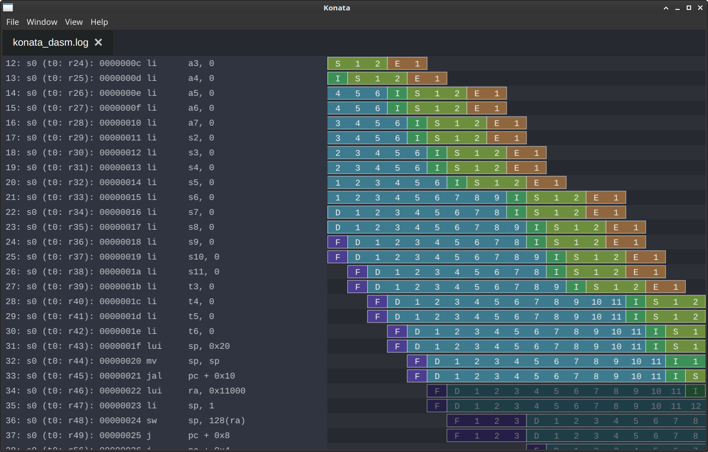

# Pipeline visualization

To gain a better understanding of the progression of data through the pipeline, you may want to visualize it. The pipeline viewer shows when an instruction is fetched, decoded, issued, executed, commited and written back. We use Konata for viewing.

## Generating the execution log

Run your test while enabling the logging option for scoooter:

```
make TB=CUSTOM_TB LOG=1
```

## Using Konata for viewing

[Konata](https://github.com/shioyadan/Konata) is a graphical pipeline viewer. SCOoOTER can generate Konata-compliant logs. After generating an execution log as described above, you may generate a konata log by executing the python-script in the root of the repository:

```
python3 extract_konata_log.py
```

The script generates `konata.log` and `konata-dasm.log`. Both logs can be opened in Konata, the latter one provides disassembled instructions.

The letters in the viewer refer to the different stages:

- F: Fetch
- D: Decode
- I: Issue
- S: Start execution - the Reservation Station forwards the instruction
- E: End execution - a result has been produced

The bar end of an instruction denotes that it has been written back and all state related to it has been cleared. Grayed out bars denote mispredicted instructions.

